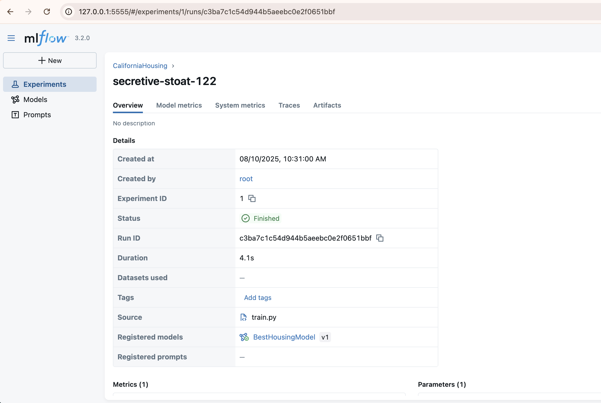
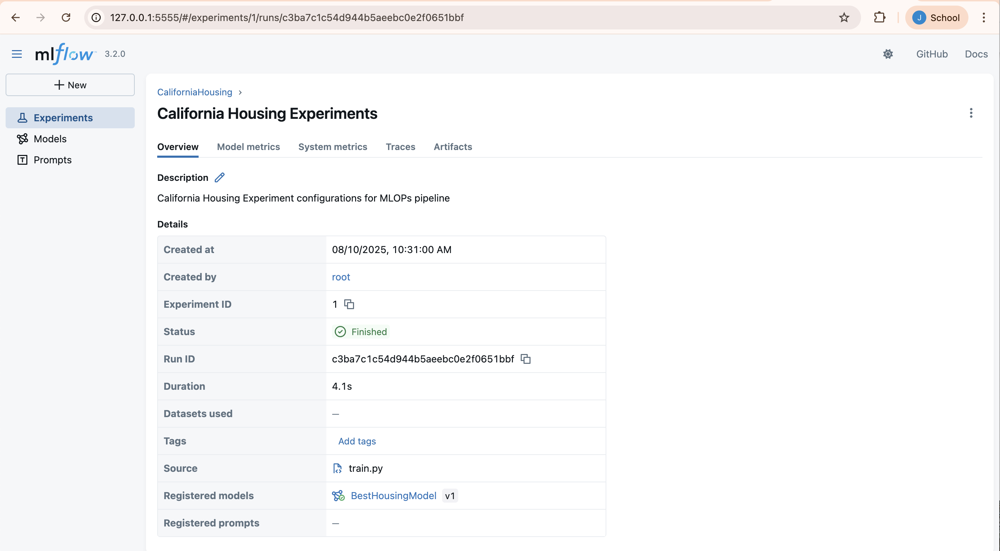
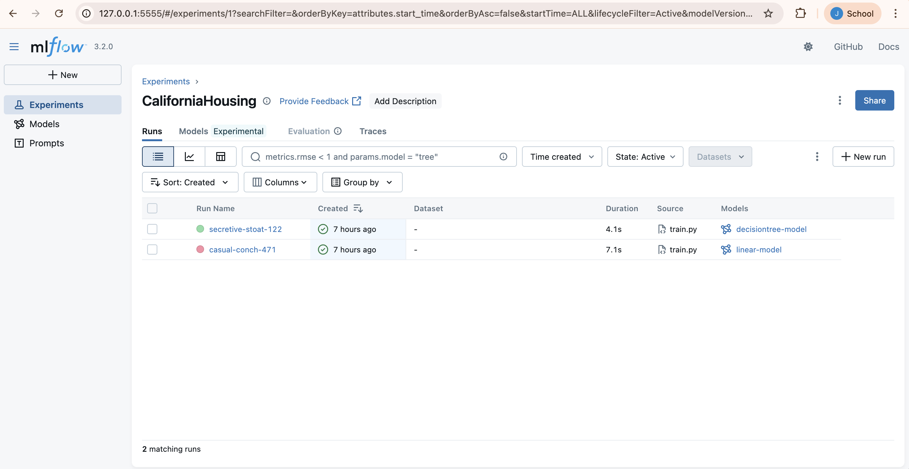
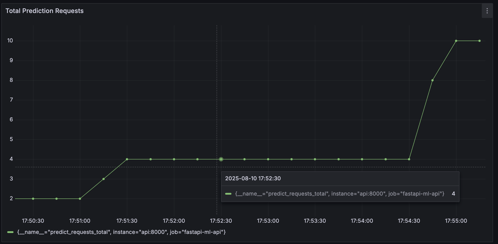
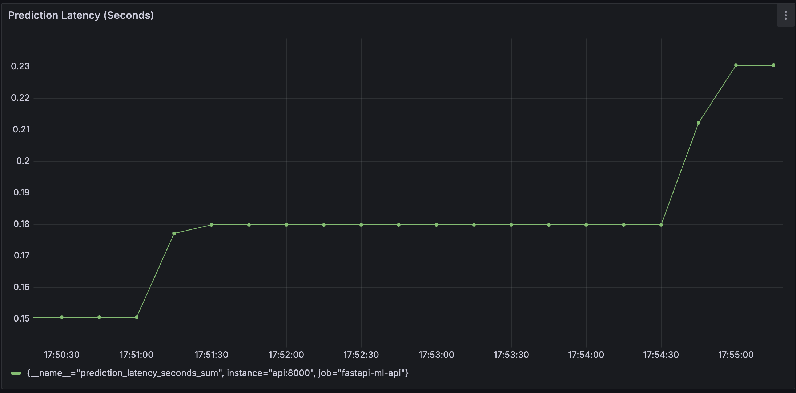
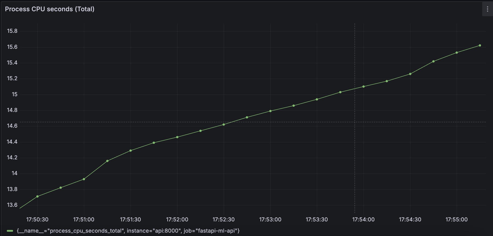
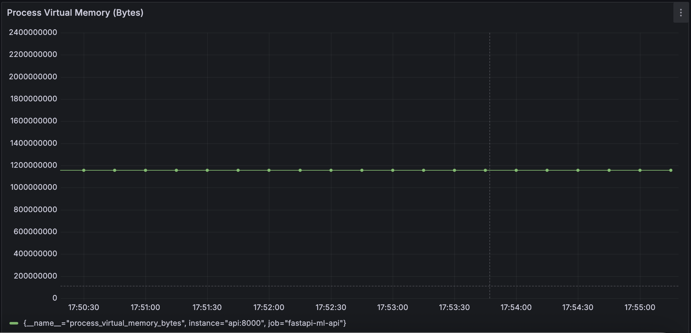
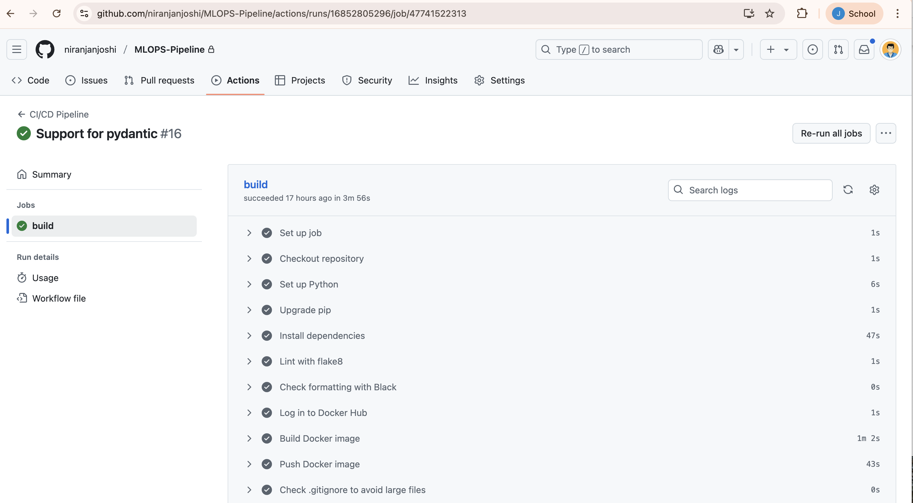

#  S2-24_AIMLCZG523 - MLOps | BITS Pilani WILP

## Group No. - 120

| Name | StudentID | Contribution % |
|------|-----------|----------------|
| JOSHI NIRANJAN SURYAKANT  | 2023AC05011 | 100% |
| PRATEEK RALHAN | 2023AC05673 | 100% |
| KESHARKAR SURAJ SANJAY | 2023AD05004 | 100% |
| SAURABH SUNIT JOTSHI | 2023AC05565 | 100%  |

---

#### ✅ Problem statement: *"Build, Track, Package, Deploy and Monitor an ML Model using MLOps Best Practices"*

## 🏠 California Housing Price Prediction [](https://www.repostatus.org/#active)
### End-to-End MLOps Pipeline

This project demonstrates a fully functional MLOps pipeline using a regression model trained on the California Housing dataset. It includes model training, model tracking, data/model versioning, API based deployments, and performance monitoring.

---

## 🎬 Video Demo


<iframe width="560" height="315" src="./demo/MLOPs_Assignment_demo.mp4" frameborder="0" allow="accelerometer; autoplay; clipboard-write; encrypted-media; gyroscope; picture-in-picture" allowfullscreen></iframe>


## 🔧 Tech Stack

| Task                | Tool(s)              |
| ------------------- | -------------------- |
| Version Control     | Git + GitHub         |
| Data Versioning     | DVC                  |
| Experiment Tracking | MLflow               |
| API Deployment      | FastAPI + Docker     |
| CI/CD               | GitHub Actions       |
| Monitoring (Logging module)         | Prometheus + Grafana |

---

## 📂 Project Structure

```
.
├── data/
│   └── housing.csv              # California housing dataset
├── models/
│   └── ridge_model.pkl          # Trained model (auto-generated)
├── src/
│   ├── config.yaml              # Model training config
│   ├── model.py                 # Model training and evaluation logic
│   └── utils.py                 # Data loading functions
├── train.py                     # Script to train and log model to MLflow
├── app.py                       # FastAPI app with predict & metrics endpoints
├── Dockerfile
├── docker-compose.yml
├── prometheus/
│   └── prometheus.yml           # Prometheus scrape config
├── .github/
│   └── workflows/ci.yml         # GitHub Actions for CI/CD
├── requirements.txt
└── README.md
```

---

## 🚀 Setup Instructions

### 1. 📦 Clone and Setup Environment

```bash
git clone https://github.com/your-username/housing-mlops.git
cd housing-mlops

# Create virtual env
python -m venv venv
source venv/bin/activate

# Install dependencies
pip install -r requirements.txt
```

### 2. 📁 Prepare Dataset (via DVC)

```bash
dvc init
dvc add data/housing.csv
git add data/housing.csv.dvc .gitignore
git commit -m "Add dataset via DVC"
```

---

## 🧠 Train and Track Model with MLflow

```bash
python train.py
```

- Logs experiment under MLflow's UI.
- Trained model saved in `models/`.
- View MLflow UI locally:

```bash
mlflow ui --port 5000
```

Navigate to [http://localhost:5000](http://localhost:5000)

---

## 🧪 Sample `config.yaml` (src/config.yaml)

```yaml
alpha: 0.5
test_size: 0.2
random_state: 42
```

| MLFLow Experiments tracking | MLFlow Metrics (MSE) |
|------|-----------|
|   |  |
|  |  |

---

## 📈 Model Serving via FastAPI + Docker

### 1. 🐳 Build & Run Services

```bash
docker-compose up --build
```

* Live public docker image on dockerhub can be found [here.🔗](https://hub.docker.com/r/niranjanjoshi14/housing-api)
* [niranjanjoshi14/housing-api:latest -> manifest digest](https://hub.docker.com/layers/niranjanjoshi14/housing-api/latest/images/sha256-63f94dc9da8f6ba82d4eac995097e238d2d74aa0d903b086bd412b33e681def3)

| Published Image Overview | Published Image - Manifest Digest | Docker desktop - testing local image |
|------|-----------|----------------|
|   |  |   |

Services exposed:

- 🧪 API Docs (Swagger): [http://localhost:8000/docs](http://localhost:8000/docs)
- 📊 Prometheus: [http://localhost:9090](http://localhost:9090)
- 📉 Grafana: [http://localhost:3000](http://localhost:3000) (Default login: `admin/admin`)

---

## 📬 Making Predictions

### Example Input (Swagger UI or `curl`):

```json
{
  "MedInc": 8.3252,
  "HouseAge": 41.0,
  "AveRooms": 6.9841,
  "AveBedrms": 1.0238,
  "Population": 322.0,
  "AveOccup": 2.5556,
  "Latitude": 37.88,
  "Longitude": -122.23
}
```

### Output:

```json
{
  "prediction": 4.534
}
```

| FastAPI endpoints & config |
|------|
|  |
|  |
|  |

---

## 📊 Monitoring with Prometheus + Grafana

### ✅ FastAPI `/metrics` Endpoint Fix

Ensure your FastAPI code exposes Prometheus metrics like this:

```python
from fastapi import Response
from prometheus_client import generate_latest, CONTENT_TYPE_LATEST

@app.get("/metrics")
def metrics():
    return Response(generate_latest(), media_type=CONTENT_TYPE_LATEST)
```

### ✅ prometheus.yml (in `prometheus/prometheus.yml`)

```yaml
global:
  scrape_interval: 15s

scrape_configs:
  - job_name: "fastapi-ml-api"
    static_configs:
      - targets: ["api:8000"]
```

Check if Prometheus sees your API at [http://localhost:9090/targets](http://localhost:9090/targets)

| Grafana logs | Grafana logs |
|------|-----------|
|   |  |
|  |  |

---

## 🔄 CI/CD with GitHub Actions

In `.github/workflows/ci.yml`, set up a job to:

- Install dependencies
- Run `train.py`
- Validate model behavior
- Optionally: Push Docker image to registry

Example CI step:

```yaml
jobs:
  test:
    runs-on: ubuntu-latest
    steps:
      - uses: actions/checkout@v3
      - name: Set up Python
        uses: actions/setup-python@v4
        with:
          python-version: "3.10"
      - run: pip install -r requirements.txt
      - run: python train.py
```



---

## 🛑 Shutdown Instructions

```bash
# Stop all containers
docker-compose down
```

Or if running in foreground, press `Ctrl + C`.

---

## 📎 Notes

- Ensure `models/ridge_model.pkl` exists after training before running Docker.
- Prometheus may throw `Content-Type` errors if `/metrics` returns JSON — fix using `Response(generate_latest(), ...)`.

---

## Citations and References

* DVC Docs: https://dvc.org/doc
* Grafana Docs: https://grafana.com/docs/
* Prometheus Docs: https://prometheus.io/docs/introduction/overview/
* Docker and Dockerhub: https://docs.docker.com/reference/cli/docker/
* Github Actions Docs: https://docs.github.com/en/actions
* MLflow Docs: https://mlflow.org/docs/latest/
* FastAPI Docs: https://fastapi.tiangolo.com/

---
